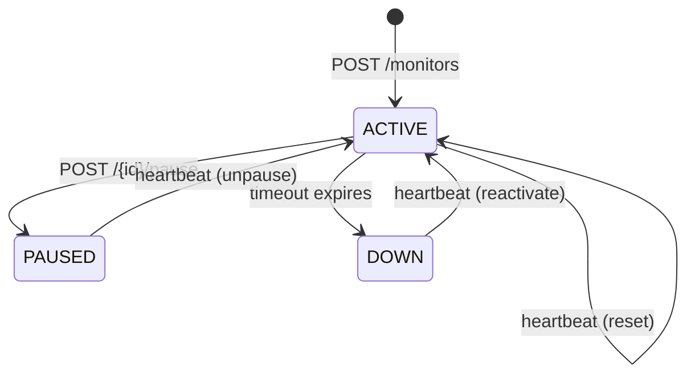
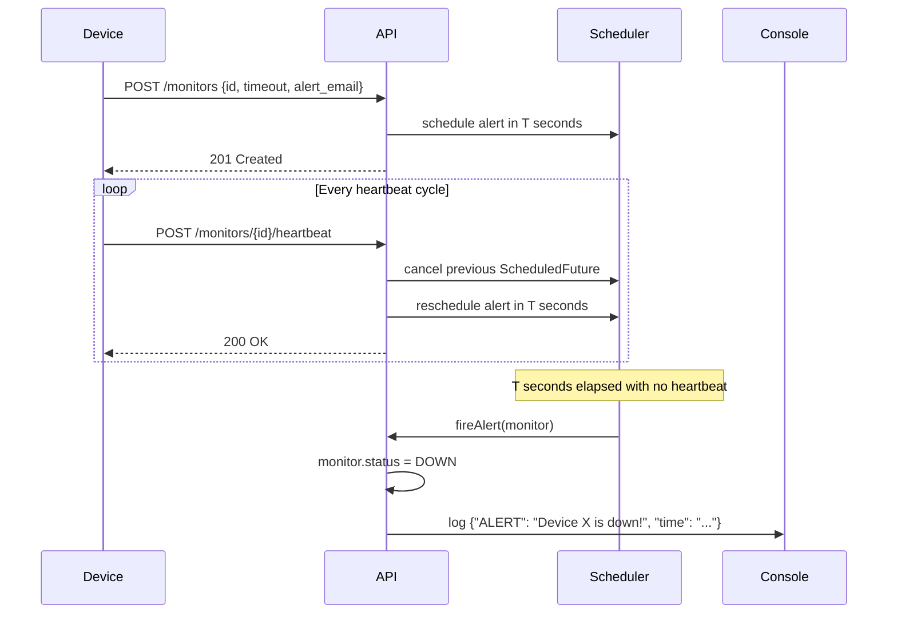

# Pulse-Check API — Dead Man's Switch Watchdog

A backend service for CritMon Servers Inc. Remote devices register a monitor with a countdown timer. If the device fails to send a heartbeat before the timer reaches zero, the system fires an alert. Built with Java 17 and Spring Boot 3.3.

---

## Architecture

### State Diagram



### Sequence Diagram



---

## Tech Stack

| Component | Technology |
|-----------|------------|
| Language | Java 17 |
| Framework | Spring Boot 3.3 |
| Build | Maven |
| Storage | `ConcurrentHashMap` (in-memory) |
| Timers | `ScheduledExecutorService` / `ScheduledFuture` |
| Tests | JUnit 5, Mockito, Spring MockMvc |

---

## Setup

### Prerequisites

- Java 17+
- Maven 3.6+

### Run the application

```bash
mvn clean install
mvn spring-boot:run
```

The API starts on **http://localhost:8080**.

### Run tests

```bash
mvn test
```

---

## API Documentation

### POST /monitors — Register a Monitor

Starts a countdown timer for the device. If no heartbeat arrives within `timeout` seconds, an alert is fired.

**Request:**
```bash
curl -X POST http://localhost:8080/monitors \
  -H "Content-Type: application/json" \
  -d '{"id": "device-123", "timeout": 60, "alert_email": "admin@critmon.com"}'
```

**Response 201 Created:**
```json
{
  "message": "Monitor device-123 registered successfully",
  "id": "device-123"
}
```

**Response 409 Conflict** (duplicate ID):
```json
{
  "error": "Monitor already exists: device-123"
}
```

---

### POST /monitors/{id}/heartbeat — Send Heartbeat

Resets the countdown. If the monitor was paused, it is automatically unpaused and the timer restarts.

**Request:**
```bash
curl -X POST http://localhost:8080/monitors/device-123/heartbeat
```

**Response 200 OK:**
```json
{
  "message": "Heartbeat received for device-123"
}
```

**Response 404 Not Found:**
```json
{
  "error": "Monitor not found: device-123"
}
```

---

### POST /monitors/{id}/pause — Pause a Monitor

Stops the countdown. No alerts will fire while paused. Sending a heartbeat automatically unpauses.

**Request:**
```bash
curl -X POST http://localhost:8080/monitors/device-123/pause
```

**Response 200 OK:**
```json
{
  "message": "Monitor device-123 paused"
}
```

**Response 404 Not Found:**
```json
{
  "error": "Monitor not found: device-123"
}
```

---

### GET /monitors/{id} — Get Monitor Status *(Developer's Choice)*

Returns the current state of a monitor, including the live remaining seconds before the next alert.

**Request:**
```bash
curl http://localhost:8080/monitors/device-123
```

**Response 200 OK:**
```json
{
  "id": "device-123",
  "status": "active",
  "remainingSeconds": 42,
  "alertEmail": "admin@critmon.com"
}
```

Possible `status` values: `active`, `paused`, `down`

**Response 404 Not Found:**
```json
{
  "error": "Monitor not found: device-123"
}
```

---

## Alert Output

When a timer expires the following is logged to stderr:

```
{"ALERT": "Device device-123 is down!", "time": "2026-04-24T10:30:00.000Z"}
```

---

## Developer's Choice: Status Endpoint

`GET /monitors/{id}` was added to give operators real-time visibility without waiting for an alert. The `remainingSeconds` field reads directly from `ScheduledFuture.getDelay()` — it reflects the live countdown, not a stored value. This enables:

- **Dashboards** — display the health of all devices at a glance.
- **Debugging** — confirm a device is actively reporting in after a maintenance window.
- **Alerting integrations** — poll this endpoint to drive external notification systems.
